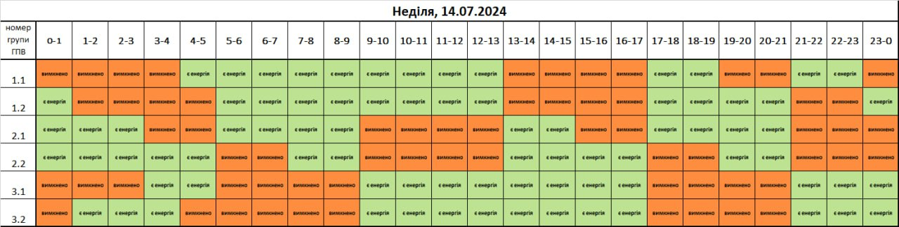

## About

Use image from https://poweron.loe.lviv.ua parse it with OpenCV and convert to available hours range.

example:

image converted to text


```
Row 0: [green orange orange orange green green green green green green green green green orange orange orange orange green green orange orange green green orange]
Row 1: [green orange orange orange green green green green green green green green green orange orange orange orange green green green green green orange green]
Row 2: [green green green green orange green green green green green orange orange green green green green orange green green green green green orange orange]
Row 3: [green green green green green orange orange green green green orange orange orange green green green green orange orange green green green orange orange]
Row 4: [orange orange orange green green orange orange orange orange green green green green green green green green orange orange orange orange green green green]
Row 5: [orange green green green green orange orange orange orange green green green green green green green green orange orange orange orange green green green]
Available hours for row 1:  [0 4 5 6 7 8 9 10 11 12 17 18 19 20 21 23]
Available ranges:  [0-1 4-13 17-22 23-24]

```


## OpenCV installation
installation OpenCV on macOS M1 chip - https://gist.github.com/nucliweb/b2a234c673221af5ec24508da7d8b854

final commands work for me:
```bash
brew install cmake
mkdir Open_CV && cd Open_CV
git clone https://github.com/opencv/opencv.git
mkdir build && cd build
cmake ../opencv/ .
arch -arm64 cmake ../opencv/ -DWITH_QT=OFF -DWITH_OPENGL=OFF -DFORCE_VTK=OFF -DWITH_TBB=OFF -DWITH_GDAL=OFF -DWITH_XINE=OFF -DBUILD_EXAMPLES=OFF -DBUILD_ZLIB=OFF -DBUILD_TESTS=OFF -DOPENCV_GENERATE_PKGCONFIG=ON .
arch -arm64 sudo make -j 4
arch -arm64 sudo make install
```
